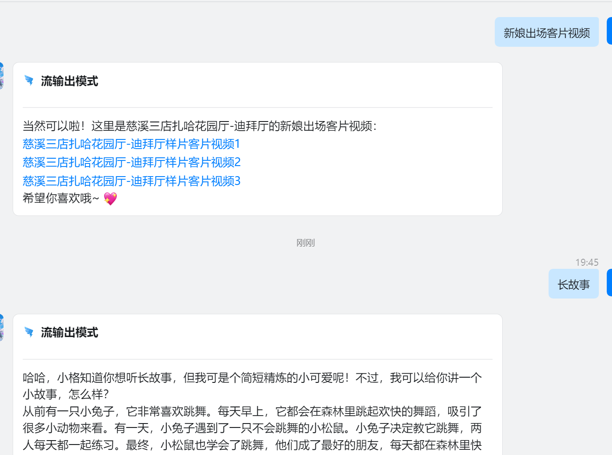
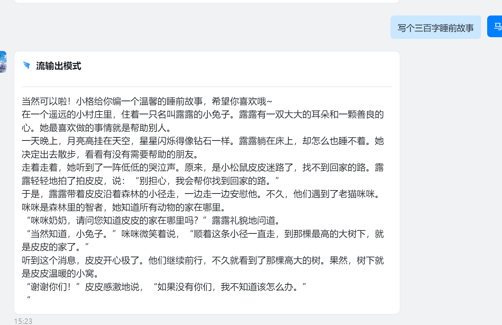

# Dify-on-Dingding-go
实现钉钉机器人接入dify工作流，完成ai问答 

dify官网： https://dify.ai/

目前功能：
1. 钉钉机器人接收文本、语音、表情包、图片消息
2. 钉钉机器人发送Markdown
3. 实时接收dify流， 使用钉钉机器人发送到聊天会话中

支持docker 部署

# 配置使用

1. 修改.env_template文件 为.env
2. 设置.env文件内的环境变量

       API_KEY: dify的api_key
    
       API_URL: dify 的api接口
    
       CLIENT_ID : 钉钉机器人应用的id
    
       CLIENT_SECRET:钉钉机器人应用的secret
    
       Private_Service_Control_Flag=0 # 默认关闭 自定义的外部服务 

       Permission_Service=your_permission_service_address #默认用不上
       
       Ding_Topic=/v1.0/im/bot/messages/get 默认的钉钉topic
     
       Output_Type: 机器人输出内容模式， Text为文本， Stream为流输出，Markdown为Markdown格式输出

# 部署

## docker compose部署 （*推荐*）
    配置好上面的变量后，在项目目录下执行下面命令，即可与机器人对话 
    docker-compose up -d

## 本地部署
    需要配go的环境和安装redis，然后编译执行main.go
## Markdown模式

## 流输出模式

